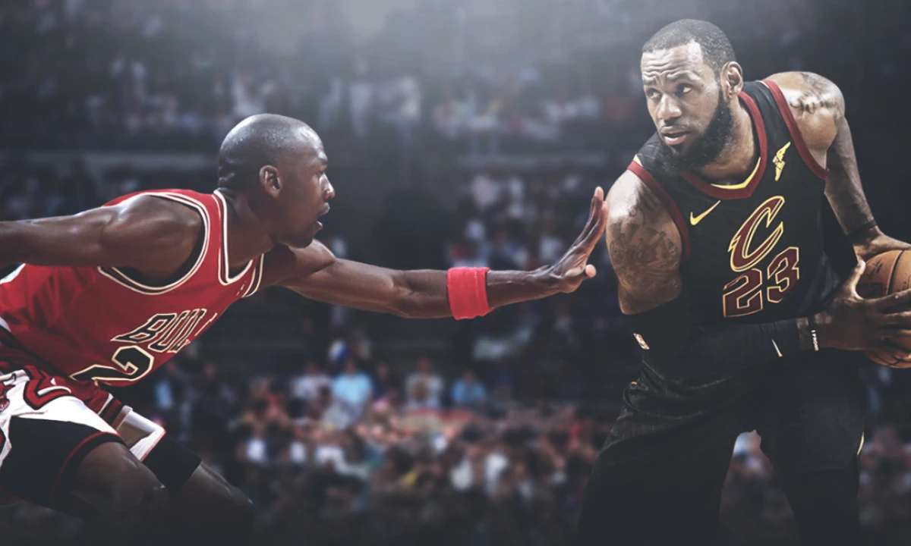

# 📊 Comparación de Michael Jordan y LeBron James

## Descripción del Proyecto
Este proyecto se centra en la comparación detallada entre las dos leyendas del baloncesto, Michael Jordan y LeBron James. Utilizando datos de dos APIs y dos páginas web, hemos recopilado y analizado sus estadísticas de carrera, incluyendo las temporadas regulares, los playoffs y su última temporada, también conocida como "Last Dance".

## Objetivos
El objetivo de este proyecto es proporcionar una visión comprensiva de la carrera de ambos jugadores, evaluando su impacto tanto dentro como fuera de la cancha, y cómo sus logros fueron remunerados a lo largo de sus trayectorias.

## Fuentes de Datos
- **APIs**: Datos de cada jugador en sus temporadas en activo y la lista de equipos al final de sus carreras.
- **Páginas web**: Información adicional sobre estadísticas y trayectoria de cada jugador.

He utilizado 2 APIs y 2 páginas webs para conseguir toda la información:
- [Salarios](https://hoopshype.com/player/michael-jordan/salary/)
- [Franquicias](https://www.basketball-reference.com/teams/)
- [BasketAPI](https://rapidapi.com/fluis.lacasse/api/basketapi1)
- **NBAAPI**: obtenida a través de una conexión directa desde Python.

## Estructura de Datos
Para facilitar la comparación, hemos creado una base de datos que organiza las temporadas en las que ambos jugadores estuvieron activos. Esta tabla conecta sus temporadas regulares, su desempeño en playoffs, sus títulos de campeón y sus salarios anuales. Además, cada temporada se asocia con las franquicias de la NBA en las que jugaron.

## Comparación de Temporadas
La base de datos contiene compara:

- **Temporadas Regulares**: Estadísticas clave para cada temporada en activo.
- **Playoffs**: Rendimiento y logros alcanzados durante los playoffs.
- **Campeonatos**: Años en los que se consagraron campeones.
- **Salario**: Remuneración recibida a lo largo de sus carreras, ligada a cada temporada.
- **Franquicias NBA**: Equipos para los que jugaron durante su carrera profesional.

## Resultados y Conclusiones

### Temporadas Regulares
- **LeBron James**:
  - Tiene una **media de FG% superior (50.82%)** y una **mediana (51%)** que demuestra consistencia a lo largo de su carrera.
  - Su rendimiento en FG% ha mejorado con los años, alcanzando **más del 56% en su última temporada**.
  - A pesar de tener un valor atípico en su distribución, su rango general muestra un alto nivel de eficiencia sostenido en temporadas regulares.

- **Michael Jordan**:
  - Su **media de FG% (48.83%)** y su **mediana (49.5%)** son ligeramente inferiores a las de LeBron.
  - Aunque tuvo un inicio sólido, su FG% decayó con el tiempo, reflejando un menor nivel de consistencia en comparación con LeBron.
  - En temporadas regulares, Jordan se apoyó en un equipo histórico que contribuyó a su éxito, especialmente en los años 90.

### Playoffs y Campeonatos
- **LeBron James**:
  - Llegó a **10 finales** y ganó **4 campeonatos** (2 con Miami, 1 con Cleveland, 1 con los Lakers).
  - Mostró consistencia en playoffs, con un FG% superior al 50% en casi todas las temporadas de campeonato.
  - Aunque perdió varias finales, su capacidad de adaptarse a diferentes equipos y liderarlos hasta la cima es notable.

- **Michael Jordan**:
  - Disputó **6 finales** y las ganó todas, mostrando una **efectividad del 100% en campeonatos**.
  - En sus primeras finales (1991-1993), promedió más de **30 puntos por partido**, consolidando su dominio en el escenario más importante.
  - Su éxito está vinculado a los Chicago Bulls, con los que construyó una de las mejores dinastías de la historia.

### Salarios y Valor Comercial
- **LeBron James**:
  - Su salario aumentó significativamente después de alcanzar las finales por primera vez con Cleveland en 2006-07.
  - Aunque cambió de equipo varias veces (Cleveland, Miami, Lakers), su remuneración siguió un crecimiento gradual y consistente.
  - Tras ganar el campeonato con Cleveland en 2016, se registró un aumento notable en su salario.

- **Michael Jordan**:
  - Durante sus años con los Bulls, especialmente entre 1996-97 y 1997-98, alcanzó los mayores picos salariales de su carrera.
  - Su influencia comercial fue enorme, lo que lo convirtió en uno de los deportistas más valiosos incluso fuera de la cancha.

### Últimas Temporadas
- **LeBron James**:
  - A los 39 años, jugó **71 partidos** con los Lakers, logrando **47 victorias** y un rendimiento sólido para su edad.
- **Michael Jordan**:
  - En su última temporada con los Wizards, jugó los **82 partidos completos**, pero con un récord negativo de **35 victorias y 47 derrotas**.

---

## Próximos Pasos
Tener en consideración franquicias que estuvieron liderando con equipos durante los años en activos de ambos jugadores, para tomar en consideración los enfrentamientos y la dificultad de conseguir un campeonato durante sus temporadas vigentes.

---

## Conclusión General
Ambos jugadores son ejemplos de excelencia, pero sus logros y estilo de juego resaltan diferentes tipos de grandeza:
- **Michael Jordan**: Fue decisivo en las finales, con un récord perfecto de 6-0, respaldado por un equipo histórico que maximizó su talento.
- **LeBron James**: Demuestra consistencia, versatilidad y longevidad, logrando grandes números tanto en temporadas regulares como en playoffs, destacando en eficiencia y adaptabilidad.

Cada uno ha dejado un impacto imborrable en la historia del baloncesto profesional. 🏀 
